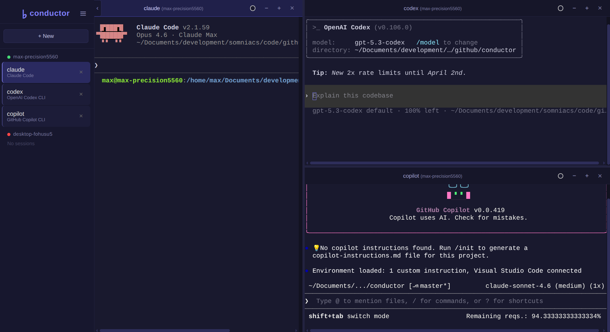
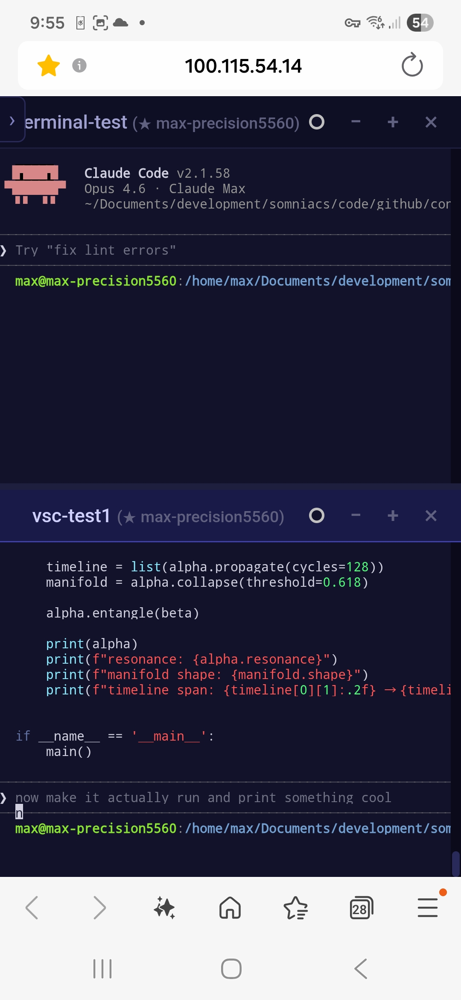
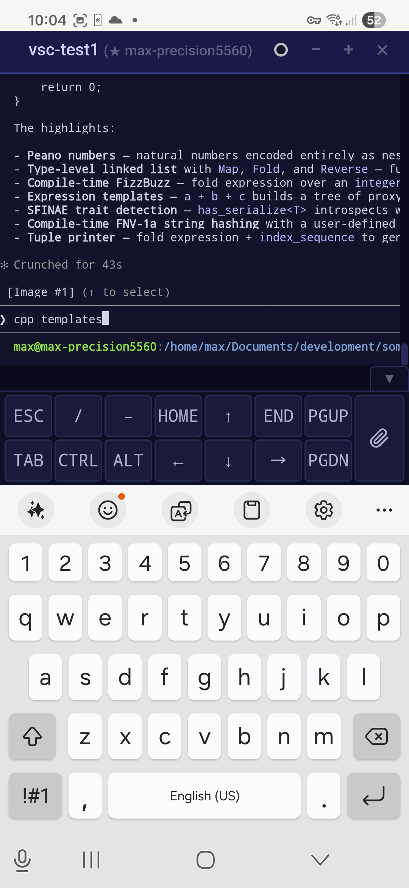

# ♭ conductor

Orchestrate your AI coding agents across your own machines — local-first, cloud-optional.

Your best ideas don't always happen at your desk. With conductor, you can start an agent session from your phone and let it run on your workstation, GPU box, or dev machine. AI agents run for minutes — sometimes hours — and then stall on a single question. If you're not at that terminal, the session idles until you return.

Conductor keeps them moving. It runs entirely on your machines. No remote backend. No vendor dependency. It wraps terminal sessions in a lightweight server and exposes them through a web dashboard you can open from your phone, tablet, or laptop. Pair it with [Tailscale](https://tailscale.com/) and you get secure access to all your machines — no port forwarding, no VPN setup, just works.

**New here?** Check out the [Quick Start Guide](docs/intro.md) — install, run an agent, and set up phone access in 5 minutes.

---

**Contents:** [What It Looks Like](#what-it-looks-like) · [How It Works](#how-it-works) · [What You Can Run](#what-you-can-run) · [Prerequisites](#prerequisites) · [Install](#install) · [Usage](#usage) · [Is It Safe?](#is-it-safe) · [Dashboard](#dashboard) · [CLI Reference](#cli-reference) · [API](#api) · [Agent Integration](#agent-integration) · [Project Structure](#project-structure) · [Platform Support](#platform-support)

---

## What It Looks Like

| Desktop | Mobile | Mobile (keyboard) |
|---------|--------|--------------------|
| <a href="data/desktop-split.png"></a> | <a href="data/mobile-split.jpg"></a> | <a href="data/mobile-keyboard.jpg"></a> |

`<agent>` is the command to run. Some examples:

| Agent | Command |
|---|---|
| Claude Code | `conductor run claude research` |
| Codex CLI | `conductor run codex backend` |
| Aider | `conductor run aider refactor` |
| Goose | `conductor run goose api` |
| GitHub Copilot | `conductor run copilot chat` |
| Custom (allowlisted) | `conductor run python3 train` |

```
Start agents                Leave your desk         Answer from anywhere
──────────────              ───────────────         ────────────────────
conductor run <agent> dev   Go to a meeting.        Open dashboard on phone.
conductor run <agent> test  Grab coffee.            See all sessions.
conductor run <agent> api   Sit on the couch.       Type a response. Done.
                                                    Agent keeps going.
```

You can also start new sessions directly from the web dashboard — pick an agent, name the session, and hit Run. No terminal needed. When you're back at your computer, attach to any running session from the terminal with `conductor attach <name>`.

Sessions survive disconnects. Close the browser, reopen it later — everything is still there. When an agent session exits with a resume token (e.g. Claude Code's `--resume`), Conductor captures it and lets you resume the conversation later — even after a reboot.

## How It Works

```
  Machine A (workstation)          Machine B (GPU box)
  ───────────────────────          ────────────────────
  Terminal Process × N             Terminal Process × N
        │                                │
    PTY Wrapper                      PTY Wrapper
        │                                │
  Conductor Server                 Conductor Server
    0.0.0.0:7777                     0.0.0.0:7777
        │                                │
        └──────── Tailscale ─────────────┘
                      │
              Browser Dashboard
          (connects to both servers)
```

Each process runs in a PTY on your machine. Output goes into a rolling in-memory buffer. When a browser connects, it gets the full buffer first, then live output over WebSocket. The dashboard connects directly to each server — no proxy, no hub. Each server stays independent.

## What You Can Run

Conductor works with any interactive terminal process. The dashboard ships with presets for common AI agents, but you can run anything from the CLI:

- **AI coding agents** — Claude Code, Aider, Codex CLI, GitHub Copilot CLI, Goose
- **Training jobs** — long-running GPU training with live output
- **Builds and test suites** — compilation, CI pipelines, test runs
- **Any terminal process** — if it runs in a terminal, Conductor can manage it

### Adding commands to the allowlist

The dashboard can only launch commands from the allowlist. The CLI is unrestricted.

**From the dashboard (recommended):** Open the hamburger menu → **Settings** (only visible on localhost). Add, edit, or remove commands from the **Allowed Commands** section and click **Save**. Changes take effect immediately on all connected clients — no restart needed. Settings are stored in `~/.conductor/config.yaml`.

**From the config file:** Edit `~/.conductor/config.yaml` directly (created on first save from Settings):

```yaml
allowed_commands:
  - command: "claude"
    label: "Claude Code"
  - command: "python3"
    label: "Python"
```

Optional fields for advanced behavior:

```yaml
  - command: "my-agent"
    label: "My Agent"
    resume_pattern: "--resume\\s+(\\S+)"  # regex to capture resume token from output
    resume_flag: "--resume"               # flag used when resuming
    stop_sequence: ["\x03", "/exit", "\r"] # graceful stop keystrokes
```

After editing the file, restart the server: `conductor restart`.

## Prerequisites

- **Python 3.10+** — check with `python3 --version` (or `py --version` on Windows)
- **Git** — to clone the repository
- **Tailscale** (optional, for remote access) — install on your workstation and your phone, tablet, or laptop. Sign in with the same account on all devices. See [tailscale.com](https://tailscale.com/)

## Install

### Linux / [macOS](docs/MACOS.md)

#### Option A — From release (recommended)

```bash
curl -sL https://github.com/somniacs/conductor/releases/latest/download/conductor.tar.gz | tar xz
cd conductor
./install.sh
```

Or download from the [Releases](https://github.com/somniacs/conductor/releases) page and run `./install.sh`.

#### Option B — From source

```bash
git clone https://github.com/somniacs/conductor.git
cd conductor
./install.sh
```

If the command is not found after install, restart your terminal or run `source ~/.bashrc` (or `~/.zshrc`).

### [Windows](docs/WINDOWS.md)

Requires Windows 10 Build 1809+ or Windows 11 (for ConPTY support).

#### Option A — From release (recommended)

```powershell
# Download and extract
Invoke-WebRequest https://github.com/somniacs/conductor/releases/latest/download/conductor.zip -OutFile conductor.zip
Expand-Archive conductor.zip -DestinationPath .
cd conductor
powershell -ExecutionPolicy Bypass -File install.ps1
```

Or download manually from the [Releases](https://github.com/somniacs/conductor/releases) page.

#### Option B — From source

```powershell
git clone https://github.com/somniacs/conductor.git
cd conductor
powershell -ExecutionPolicy Bypass -File install.ps1
```

The install script checks for Python 3.10+, installs [pipx](https://pipx.pypa.io/) if needed, and installs Conductor system-wide. After it finishes, the `conductor` command is available from any terminal.

<details>
<summary>Manual install (without install script)</summary>

**Linux / macOS:**
```bash
git clone https://github.com/somniacs/conductor.git
cd conductor
python3 -m venv .venv
source .venv/bin/activate
pip install -e .
```

**Windows:**
```powershell
git clone https://github.com/somniacs/conductor.git
cd conductor
python -m venv .venv
.venv\Scripts\activate
pip install -e .
```

</details>

### Updating

The dashboard shows a notification when a new version is available. To update, download the latest release and run `./install.sh` (or `install.ps1` on Windows) again. Your settings (`~/.conductor/config.yaml`), sessions, and uploads are preserved — only the application code is replaced.

## Usage

### Start sessions

```bash
# Start one session (server auto-starts in background)
conductor run <agent> research

# Start more
conductor run <agent> coding
conductor run <agent> review
```

Open the dashboard in your browser — locally at `http://127.0.0.1:7777`, or from any device on your Tailscale network at `http://100.x.x.x:7777` (your Tailscale IP).

Want the dashboard always available? See [Auto-Start on Boot](docs/autostart.md) for systemd, launchd, and Task Scheduler setup.

### Multi-machine setup

Conductor supports connecting to multiple machines from a single dashboard. Each machine runs its own independent Conductor server. The dashboard in your browser connects to all of them directly — no central hub or proxy needed.

**1. Install and start Conductor on each machine:**

```bash
# On workstation
conductor run <agent> research
conductor run <agent> coding

# On GPU box (install Conductor there too)
conductor run <agent> train
```

**2. Add machines to the dashboard:**

Open the dashboard on any device, then hamburger menu → **Servers**.

- **Tailscale device picker** — your online Tailscale devices appear in a dropdown. Select one and click Add. This is the easiest way.
- **Manual URL** — paste `http://100.x.x.x:7777` (or a MagicDNS name) for any machine on your network.
- **QR code** — run `conductor qr` on a machine, then use **Link Device** in the dashboard to scan it.

**How it works:**

The dashboard polls each server independently for sessions and connects via separate WebSockets. The sidebar groups sessions by machine with connection status indicators:

```
● Workstation (local)
  research
  coding
● GPU Box
  train
```

You can open terminals from different machines side by side in split view — one panel showing your workstation session, another showing your GPU box, both live.

**What happens when a machine goes offline:**

The dashboard detects the disconnect within seconds. Sessions from that machine disappear from the sidebar and any open terminal panels for it close automatically. When the machine comes back, sessions reappear.

**Persistence:**

Added machines are saved in your browser's localStorage. Refresh the page or close and reopen — your server list is preserved. Each browser/device maintains its own list independently.

### Session resume

When an agent exits and prints a resume token — like Claude Code's `--resume <session-id>` — Conductor captures it from the terminal output automatically. The session stays in the sidebar as **resumable** with a play button. Click it and Conductor starts a new session with the original command plus the resume flag, picking up where you left off.

Agents that manage their own session history — like Codex (`codex resume`) and Copilot (`copilot --resume`) — are always marked as resumable when they exit. Clicking the play button launches the agent's built-in resume command.

Resume tokens are persisted to disk (`~/.conductor/sessions/`), so they survive server restarts and machine reboots. Power-cycle your laptop, start Conductor again, and the resumable session is still there.

If you don't need a resumable session, dismiss it with the **×** button — a confirmation dialog prevents accidental deletion.

**Creating sessions on remote machines:**

Click **+ New** in the sidebar. When multiple machines are connected, a **Machine** dropdown appears at the top of the form. Select the target machine, pick a command and directory (fetched from that machine's config), and click Run. The session starts on the remote machine and opens in a terminal panel.

**Single-server mode:**

When only one server is configured (the default), the dashboard looks and works exactly as a standalone single-machine setup. No server group headers, no machine selector — zero visual overhead.

### Remote access from another device

This requires [Tailscale](https://tailscale.com/) on both your workstation and your phone, tablet, or laptop.

**1. Start Conductor on your workstation** (if not already running):

```bash
conductor run <agent> research
```

**2. Open on your other device:**

Option A — run `conductor qr` to show a scannable QR code:

```bash
conductor qr
```

Option B — use the dashboard's **Servers** dialog (hamburger menu → Servers) to see Tailscale devices and add them.

Option C — find your Tailscale IP and type the URL:

```bash
tailscale ip -4
# 100.x.x.x
```

Then open `http://100.x.x.x:7777` on your phone.

Done. Full terminal access to all sessions from your phone — type prompts, view output, create or kill sessions. Add more machines from the Servers dialog.

### Using Tailscale MagicDNS names

Tailscale assigns each device a [MagicDNS](https://tailscale.com/kb/1081/magicdns) name like `my-workstation.tailnet-name.ts.net`. You can use these instead of IP addresses:

```
http://my-workstation.tailnet-name.ts.net:7777
```

To find your machine's name:

```bash
tailscale status
# or check the Conductor dashboard: hamburger menu → Servers → "This server"
```

The Servers dialog shows your machine's MagicDNS name, Tailscale IP, and hostname — all fetched from the `/info` endpoint. MagicDNS names are easier to remember and don't change when IPs rotate.

### Why remote access works

Tailscale creates a private network between your devices using WireGuard. Only your devices can reach the server. No ports exposed to the internet, no passwords, no setup beyond installing Tailscale. Conductor binds to `0.0.0.0` so it's reachable on your Tailscale network without any extra configuration.

## Is It Safe?

Yes. Conductor runs entirely on your machines — no cloud backend, no vendor account, no external service required. Output stays local; commands run locally; nothing is logged, queued, or controlled through any third-party service.

- **No cloud dependency** — runs on your workstation, GPU box, or air-gapped network. No API keys, no SaaS backend, zero cloud costs.
- **Local only** — the server binds to your machine. Without Tailscale (or another VPN), it is not reachable from outside your local network.
- **No authentication layer needed** — when using Tailscale, only devices signed into *your* Tailscale account can reach the server. The network itself is the firewall.
- **No data leaves your machine** — session output stays in an in-memory buffer on localhost. Nothing is logged to external services.
- **Restricted dashboard commands** — the web dashboard can only launch commands from a predefined allowlist. The CLI is unrestricted, but the browser cannot start arbitrary processes.
- **Localhost-only admin** — the Settings panel and admin API (`/admin/settings`) are only accessible from `127.0.0.1`. Remote clients cannot view or modify server configuration.
- **No shell injection** — session input is sent through the PTY as keystrokes, not evaluated as shell commands by Conductor itself.
- **Sanitized session names** — names are validated against a strict allowlist (alphanumeric, hyphens, underscores, max 64 chars) on both the frontend and backend to prevent path traversal or injection via crafted names.
- **Open source (MIT)** — the entire codebase is a single Python package and a single HTML file. Read it, audit it, fork it.

If you're running Conductor on a shared network without Tailscale, anyone on that network can reach port 7777. In that case, use a firewall rule or bind to `127.0.0.1` instead of `0.0.0.0`.

## Dashboard

The web dashboard provides:

- **Multi-machine view** — connect to multiple Conductor servers, sessions grouped by machine
- **Tailscale device picker** — discover and add machines from your Tailscale network
- **Session sidebar** — all sessions with focus tracking, grouped by machine in multi-server mode
- **Terminal panels** — full xterm.js rendering with colors, cursor, scrollback
- **Split view** — place panels Left, Right, Top, or Bottom with arbitrary nesting and draggable dividers
- **Keyboard input** — type directly into the terminal
- **New session** — create sessions on any connected machine with directory picker
- **Session resume** — exited sessions with a resume token show a play button; resume with one click
- **Kill confirmation** — stop sessions with a confirmation dialog
- **Color themes** — 6 presets per panel: Default, Dark, Mid, Bright, Bernstein, Green (retro CRT)
- **Font size controls** — per-panel `+` / `−` buttons, adaptive defaults for desktop and mobile
- **Idle notifications** — browser notification when a session is waiting for input (when tab not visible)
- **Link Device** — QR code in the hamburger menu for opening the dashboard on another device
- **Settings panel** — manage allowed commands, directories, buffer size, upload limits, and stop timeout from the dashboard (localhost only). Changes persist and propagate to all clients automatically
- **Server management** — add/remove servers, Tailscale device picker, QR scanner, connection status
- **File upload** — paste (Ctrl+V), drag-and-drop, or use the attachment button to upload any file (images, PDFs, code, text, etc.); shows an upload dialog with progress, then lets you insert the file path into the terminal or copy it to clipboard. Uploaded files are auto-cleaned when the session ends
- **Mobile extra keys** — on-screen toolbar with ESC, TAB, arrows, CTRL, ALT, Page Up/Down, Home/End, and attachment button; appears above the virtual keyboard on touch devices, with collapsible drawer (state persisted)
- **Mobile touch scroll** — one-finger scroll with momentum in terminal panels
- **Collapsible sidebar** — chevron toggle, auto-reopens when all panels close
- **Update notification** — on load, the dashboard checks GitHub for new releases. When a newer version exists, a small banner appears at the bottom of the sidebar. Click it to open the release page — no automatic download or install, you stay in full control
- **Auto-reconnect** — WebSocket reconnects automatically on disconnect
- **Minimum 80 columns** — narrow panels get horizontal scroll instead of reflow
- **Mobile-friendly** — responsive drawer, touch targets, dynamic viewport height, adaptive font size and scrollback

## CLI Reference

| Command | Description |
|---|---|
| `conductor serve` | Start the server (foreground) |
| `conductor serve --host 0.0.0.0 --port 8888` | Custom host/port |
| `conductor run COMMAND [NAME]` | Start session and attach (see output in terminal) |
| `conductor run -d COMMAND [NAME]` | Start session in background (detached) |
| `conductor run --json COMMAND [NAME]` | Start session and print JSON (implies detach) |
| `conductor attach NAME` | Attach to a running session |
| `conductor list` | List active sessions |
| `conductor list --json` | List sessions as JSON |
| `conductor status` | Show server status |
| `conductor status --json` | Show server status as JSON |
| `conductor stop NAME` | Stop a session |
| `conductor shutdown` | Stop the server and all sessions |
| `conductor restart` | Restart the server (picks up config changes) |
| `conductor open` | Open the dashboard in the default browser |
| `conductor qr` | Show QR code (terminal + opens SVG in browser) |

`conductor run` auto-starts the server as a background daemon if it isn't already running. If no name is given, the command name is used. Press `Ctrl+]` to detach from a session without stopping it.

## API

Default port `7777`. All endpoints relative to your host. OpenAPI spec at `/openapi.json`.

| Method | Endpoint | Description |
|---|---|---|
| `GET` | `/health` | Health check (`{"ok": true, "version": "..."}`) — always public |
| `GET` | `/sessions` | List all sessions |
| `GET` | `/sessions/{id}` | Get a single session |
| `POST` | `/sessions/run` | Create session (`{"name": "...", "command": "..."}`) |
| `POST` | `/sessions/{id}/input` | Send input (`{"text": "..."}` and/or `{"keys": ["CTRL+C"]}`) |
| `POST` | `/sessions/{id}/resize` | Resize PTY (`{"rows": 24, "cols": 80}`) |
| `POST` | `/sessions/{id}/upload` | Upload a file (raw body, any content type, optional `X-Filename` header) → `{"path": "...", "filename": "..."}` |
| `POST` | `/sessions/{id}/resume` | Resume an exited session with a stored resume token |
| `POST` | `/sessions/{id}/stop` | Stop a session (alias for DELETE) |
| `DELETE` | `/sessions/{id}` | Kill session (or dismiss a resumable session) |
| `WS` | `/sessions/{id}/stream` | Bidirectional WebSocket — output out, keystrokes in |
| `WS` | `/sessions/{id}/stream?typed=true` | Typed JSON WebSocket for agents |
| `GET` | `/info` | Server identity (hostname, port, Tailscale IP/name) |
| `GET` | `/tailscale/peers` | Online Tailscale peers for device picker |
| `GET` | `/config` | Allowed commands and default directories |
| `GET` | `/browse?path=~` | Directory listing for the directory picker |
| `GET` | `/admin/settings` | Full admin settings (localhost only, 403 for remote) |
| `PUT` | `/admin/settings` | Update settings and persist to `~/.conductor/config.yaml` (localhost only) |

## Agent Integration

Conductor exposes a stable API that AI agents and automation tools can use to start, monitor, and interact with terminal sessions programmatically.

### Discovery

Check if the server is running and get connection details:

```bash
# CLI
conductor status --json
# → {"ok": true, "version": "0.3.0", "base_url": "http://127.0.0.1:7777", ...}

# HTTP
curl http://127.0.0.1:7777/health
# → {"ok": true, "version": "0.3.0"}
```

The full OpenAPI spec is at `http://127.0.0.1:7777/openapi.json`.

### Start a session

```bash
curl -X POST http://127.0.0.1:7777/sessions/run \
  -H "Content-Type: application/json" \
  -d '{"name": "my-agent", "command": "echo hello", "source": "cli"}'
```

The response includes a `ws_url` field for streaming output.

### Stream output (typed WebSocket)

Connect to the typed WebSocket endpoint for structured JSON messages:

```
ws://127.0.0.1:7777/sessions/my-agent/stream?typed=true
```

**Server sends:**
- `{"type": "stdout", "data": "..."}` — terminal output
- `{"type": "exit", "exit_code": 0}` — session ended
- `{"type": "ping"}` — keepalive

**Client sends:**
- `{"type": "input", "data": "..."}` — text input
- `{"type": "resize", "rows": 40, "cols": 120}` — resize terminal
- Plain text fallback: non-JSON text is treated as raw input

### Send input

```bash
# Text input
curl -X POST http://127.0.0.1:7777/sessions/my-agent/input \
  -H "Content-Type: application/json" \
  -d '{"text": "yes\n"}'

# Key sequences
curl -X POST http://127.0.0.1:7777/sessions/my-agent/input \
  -H "Content-Type: application/json" \
  -d '{"keys": ["CTRL+C"]}'
```

**Supported key names:** `ENTER`, `TAB`, `ESCAPE`, `BACKSPACE`, `UP`, `DOWN`, `LEFT`, `RIGHT`, `CTRL+A`, `CTRL+C`, `CTRL+D`, `CTRL+E`, `CTRL+K`, `CTRL+L`, `CTRL+R`, `CTRL+U`, `CTRL+W`, `CTRL+Z`, `CTRL+\`

### Resume a session

List sessions, find one by name, and reconnect:

```bash
# List all sessions
curl http://127.0.0.1:7777/sessions

# Reconnect WebSocket to an existing session
ws://127.0.0.1:7777/sessions/my-agent/stream?typed=true
```

### Authentication

Set `CONDUCTOR_TOKEN` as an environment variable before starting the server:

```bash
export CONDUCTOR_TOKEN=my-secret-token
conductor serve
```

When set, all API requests (except `/health`) require a Bearer token:

```bash
curl -H "Authorization: Bearer my-secret-token" http://127.0.0.1:7777/sessions
```

WebSocket connections accept the token as a query parameter:

```
ws://127.0.0.1:7777/sessions/my-agent/stream?typed=true&token=my-secret-token
```

When no token is configured, the API is open (same as before).

## Project Structure

```
conductor/
├── conductor/
│   ├── server/app.py        # FastAPI app + static serving
│   ├── api/routes.py         # REST + WebSocket endpoints
│   ├── sessions/
│   │   ├── session.py        # Session — PTY, buffer, subscribers
│   │   └── registry.py       # In-memory session registry
│   ├── proxy/pty_wrapper.py  # PTY spawn and I/O
│   └── utils/config.py       # Paths, ports, allowed commands
├── cli/main.py               # Click CLI
├── static/index.html          # Dashboard (single-file HTML/JS/CSS)
├── main.py                    # Entry point
├── install.sh                 # One-step installer (Linux/macOS)
├── install.ps1                # One-step installer (Windows)
├── pyproject.toml
└── LICENSE                    # MIT
```

## Platform Support

| Platform | Status |
|---|---|
| Linux | Supported |
| macOS | Supported — [setup guide](docs/MACOS.md) |
| Windows | Supported (10 Build 1809+) — [setup guide](docs/WINDOWS.md) |

## Requirements

- Python 3.10+
- Linux, macOS, or Windows 10+ (PTY / ConPTY required)
- Dependencies: FastAPI, uvicorn, click, httpx, websockets, qrcode, pywinpty (Windows only)
